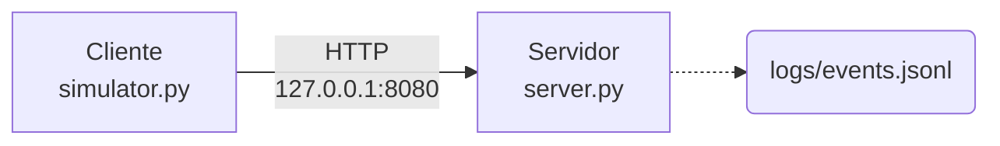
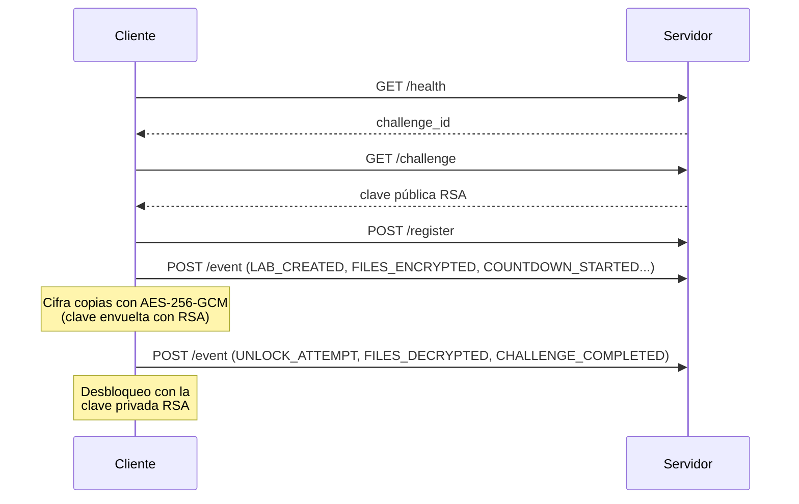

# Educational Ransomware CTF

Laboratorio educativo para el entrenamiento de equipos SOC y DFIR.

El proyecto reproduce el comportamiento visual y operativo de un incidente de
ransomware, diseñado para ejecutarse dentro de un entorno controlado (sandbox
o laboratorio).

## Características

- Copia de ficheros señuelo a `RansomwareTrainingLab/`.
- Cifrado simulado con AES-256-GCM sobre dichas copias (ficheros `.enc`).
- Clave AES protegida con RSA-OAEP-SHA256 (2048 bits).
- Cuenta atrás de 8 horas.
- Challenge ID único por sesión (`CTF-XXXXXXXX`).
- Comunicación únicamente con `localhost:8080`.
- Servidor Flask que gestiona el CTF y registra los eventos.
- Desbloqueo validando la clave privada RSA.
- No se cifran ni se eliminan ficheros reales.

## Estructura

```text
maldev-educational-ransomware/
│
├── client/
│   ├── simulator.py          ← Cliente del CTF
│   ├── ctf_client.py
│   ├── public_key.pem
│   └── requirements.txt
│
├── server/
│   ├── server.py             ← Servidor del CTF
│   ├── requirements.txt
│   ├── .env.example
│   ├── private_key.pem
│   └── logs/
│
├── docs/
│   ├── SETUP.md
│   ├── DFIR-TRAINING.md
│   ├── SOC-TRAINING.md
│   ├── INCIDENT-REPORT.md
│   └── INSTRUCTOR-GUIDE.md
│
├── lab_files/
│   ├── example.txt
│   ├── example.pdf
│   └── example.jpg
│
├── README.md
├── LICENSE
└── .gitignore
```



## Arrancar el CTF

```bash
python -m venv .venv
source .venv/bin/activate
pip install -r server/requirements.txt -r client/requirements.txt

python server/server.py   # imprime el Challenge ID y escucha en 127.0.0.1:8080
python client/simulator.py
```

## Componentes



### Servidor (`server.py`)

- Genera y guarda el par de claves RSA en `server/keys/`.
    - Se crea en el primer arranque.
- Expone la API del CTF y valida el Challenge ID.
- Registra cada evento en `server/logs/events.jsonl` (JSON Lines).
- Valida el desbloqueo con `POST /unlock`.
    - La clave privada recibida **no** se devuelve nunca.
    - El participante debe obtenerla investigando localmente.

#### API del servidor

| Método | Ruta        | Descripción                                                         |
| :----: | :---------- | :------------------------------------------------------------------ |
| GET    | `/health`   | Estado del servicio y `challenge_id`                                |
| GET    | `/challenge`| Datos del reto y clave pública en PEM                               |
| POST   | `/register` | Registra `hostname` y `username` del cliente                        |
| POST   | `/event`    | Registra eventos del catálogo autorizado en `events.jsonl`          |
| POST   | `/unlock`   | Valida una clave privada en PEM (base64); responde `success: true/false` |

Eventos admitidos en `/event`:

- `LAB_CREATED`
- `AES_KEY_GENERATED`
- `FILES_ENCRYPTED`
- `COUNTDOWN_STARTED`
- `UNLOCK_ATTEMPT`
- `FILES_DECRYPTED`
- `CHALLENGE_COMPLETED`.

### Cliente (`simulator.py`)

1. Comprueba la salud del servidor y descarga la clave pública.
2. Se registra con hostname y usuario.
3. Copia los ficheros de entrenamiento a `RansomwareTrainingLab/`.
4. Cifra las copias con *AES-256-GCM* y envuelve la clave con *RSA-OAEP-SHA256*.
5. Escribe los metadatos del reto en `challenge.json` y la traza en `client.log`.
6. Muestra la cuenta atrás de 8 horas.
7. Permite el desbloqueo introduciendo la clave privada RSA.

## Artefactos generados

| Artefacto                          | Ubicación                              |
| ---------------------------------- | -------------------------------------- |
| Copias cifradas (`.enc`)           | `RansomwareTrainingLab/`               |
| Metadatos del reto                 | `RansomwareTrainingLab/challenge.json` |
| Log del cliente                    | `RansomwareTrainingLab/client.log`     |
| Eventos del servidor               | `server/logs/events.jsonl`             |
| Par de claves RSA (primer arranque)| `server/keys/`                         |

## Documentación

- `docs/DFIR-TRAINING.md`: guía de investigación forense.
    - Fuentes de evidencia, línea temporal, análisis de ficheros, red y procesos, y conclusiones del informe.
- `docs/SOC-TRAINING.md`: guía de triage e investigación para el analista SOC.
    - Escenario inicial y las acciones esperadas.
- `docs/INCIDENT-REPORT.md`: plantilla de informe de incidente.
    - Rellenar durante el ejercicio.

